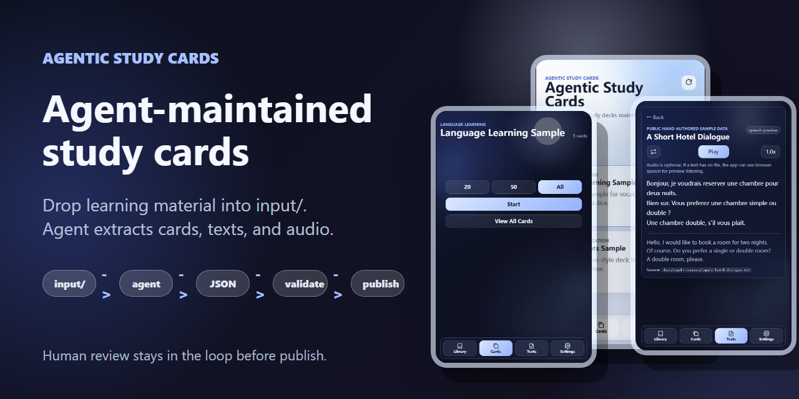
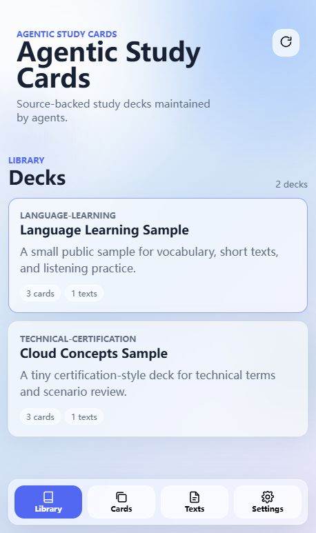
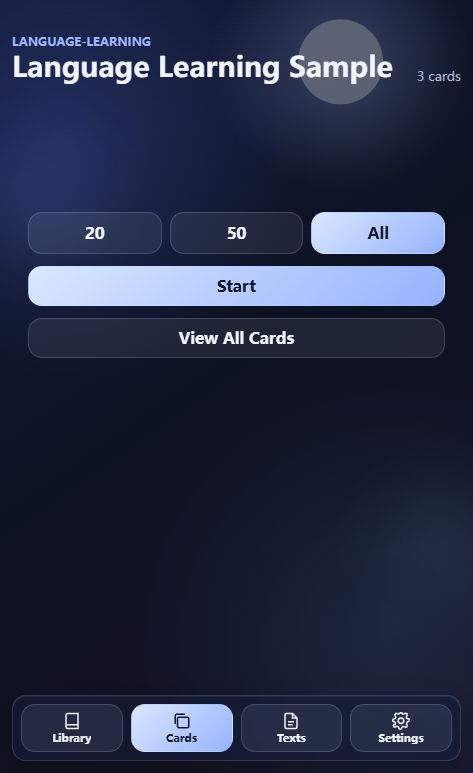
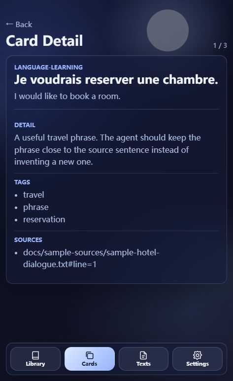
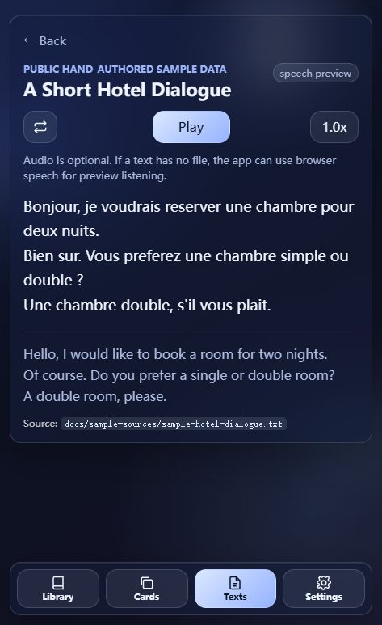

# Agentic Study Cards

> Born from my personal agent-assisted learning workflow: loose class materials go in, source-backed study cards and notes come out.

[简体中文](README.zh-CN.md)



A mobile-first static study app designed to be maintained by an AI agent.
Prepared for publication under `benie-studio-oss`.

This is not only a flashcard UI. It is a small, inspectable workflow for turning raw learning material into reviewed, deployable study content:

```text
input/ material -> agent extraction -> JSON -> validation -> human approval -> static deploy
```

The app is intentionally simple: JSON is the source of truth, raw material stays in an ignored inbox, and an agent turns source material into review cards, readable texts, notes, and optional audio. After validation, a human confirms the update and the site can be pushed to GitHub and deployed on Vercel, Cloudflare Pages, or GitHub Pages.

## For Humans

- Put PDFs, images, audio, transcripts, or notes in `input/`.
- Ask your agent to follow `docs/AGENT_WORKFLOW.md`.
- Review the generated `data/decks/*.json` changes.
- Run `npm run validate`.
- Approve, commit, push, and let your static host redeploy.

## For Agents

Start here:

1. Read `docs/AGENT_WORKFLOW.md`.
2. Read `docs/SCHEMA.md`.
3. Read `AGENTS.md` for repo-local operating rules.
4. Use `docs/skills/` as optional domain guidance.
5. Update only publishable artifacts under `data/` and optional audio under `audio/`.
6. Run `node scripts/validate-content.js`.
7. Ask the human before commit/publish.

Important constraints:

- Keep cards and texts source-backed.
- Do not invent source references.
- Do not overwrite source audio with TTS.
- Use `cards[]` for vocabulary, concepts, Q&A, and technical terms.
- Keep adapter/runtime-specific behavior outside the static app contract.

## What This Starter Shows

- A workflow for agent-assisted study material maintenance, not just a card UI.
- A polished liquid-glass study interface.
- Generic `cards[]` and `texts[]` schemas for language learning, exam prep, technical certification, or a custom domain.
- Optional card/text audio with source-vs-TTS metadata.
- Text listening controls with single-text repeat and playback speed choices.
- Model-neutral agent workflow docs and starter skill templates.
- A no-dependency validation script for catalog, decks, required fields, and referenced audio files.

## Screenshots

<table>
  <tr>
    <td></td>
    <td></td>
  </tr>
  <tr>
    <td></td>
    <td></td>
  </tr>
</table>

## Quick Start

```bash
python -m http.server 4173
```

Then open `http://localhost:4173`.

Run validation:

```bash
npm run validate
```

## Platform

This is not a Windows-only project. The app is plain static HTML/CSS/JS, and the validator uses only Node built-in modules.

- macOS/Linux: `python3 -m http.server 4173`
- Windows: `python -m http.server 4173`
- Any OS: run validation with `npm run validate`

Use repo-relative paths with forward slashes in JSON, such as `data/decks/example.json` or `audio/texts/example.mp3`. That keeps the same content usable on macOS, Windows, Linux, GitHub, and static hosting providers.

## Repository Layout

- `index.html` - static app shell.
- `assets/` - app JavaScript and liquid-glass CSS.
- `data/catalog.json` - registry of public decks.
- `data/decks/` - editable deck JSON files.
- `audio/` - optional card and text audio referenced by deck JSON.
- `input/` - ignored inbox for raw user material.
- `docs/` - public design, workflow, adapter, schema, and validation notes.
- `docs/skills/` - optional starter skills for different study domains.
- `scripts/validate-content.js` - no-dependency content validator.

## Adapter Philosophy

There are many agent frameworks, so the starter avoids binding itself to one runtime.

The minimum adapter is just a disciplined file handoff:

1. Put user material into `input/`.
2. Let the agent generate or update `data/decks/*.json`.
3. Add optional audio under `audio/`.
4. Run validation.
5. Ask the human to approve.
6. Commit and publish only after approval.

If your framework has gateways, queues, tools, or scheduled workers, keep that glue outside the app and preserve the same file contract. See `docs/ADAPTERS.md`.

## Audio Policy

Card audio and text audio are optional.

- If a source audio file exists for a text, reference it as `kind: "source"`.
- If no source audio exists and the user wants listening practice, the agent may generate TTS and reference it as `kind: "tts"`.
- Source audio must never be overwritten by generated audio.
- Validation only checks referenced files; it does not generate audio.

## Minimal Deck Shape

```json
{
  "schema": "agentic-study-cards.deck.v1",
  "id": "sample",
  "title": "Sample Deck",
  "cards": [
    {
      "id": "card-1",
      "front": "What does IaaS mean?",
      "back": "Infrastructure as a Service",
      "detail": "A cloud model for renting compute, storage, and networking.",
      "tags": ["cloud", "fundamentals"],
      "sourceRefs": ["input/example.pdf#page=2"]
    }
  ],
  "texts": [
    {
      "id": "text-1",
      "title": "Short Reading",
      "body": "A source-backed text or transcript.",
      "translation": "Optional translation or explanation.",
      "audio": {
        "kind": "tts",
        "file": "audio/texts/text-1.mp3"
      }
    }
  ]
}
```

See `docs/PUBLIC_STARTER_DESIGN.md` for the fuller design, `docs/SCHEMA.md` for the editable JSON contract, and `docs/PUBLIC_RELEASE_CHECKLIST.md` before publishing a public repository.

> [!NOTE]
> No "buy me a coffee" button here. If this saves you time, buy Codex and GLM tokens instead. The machines are thirsty. 🤖🥤
